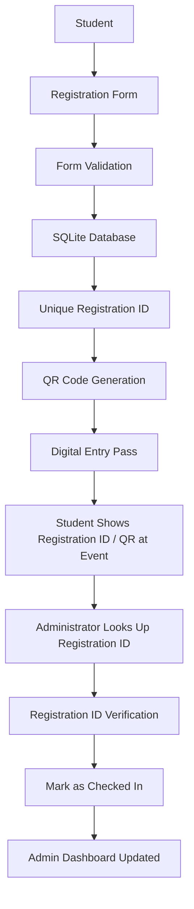
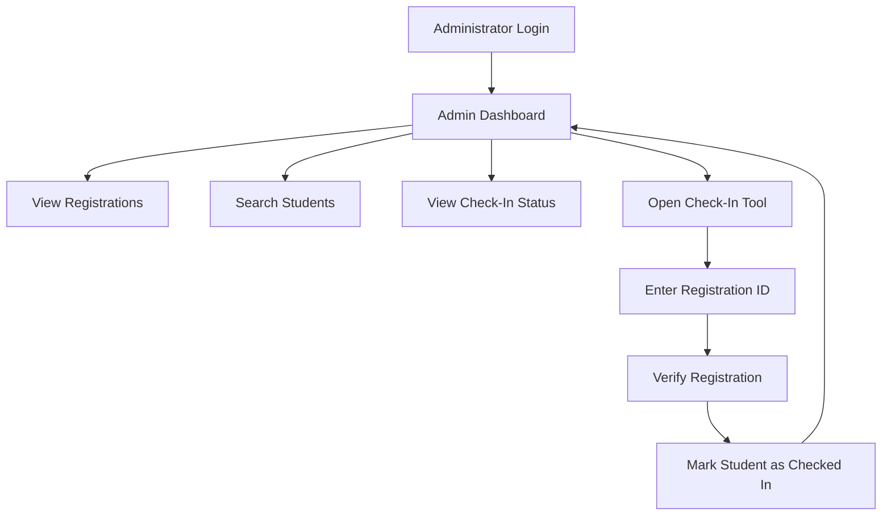

# 🎉 Fresher Party 2026
### QR Registration & Smart Check-In System

A web-based event registration and QR check-in system built for **Fresher Party 2026**. It digitizes student registration, generates a unique QR-coded digital entry pass for every participant, and gives event administrators a simple dashboard to verify and check students in at the venue.


---

## 📖 About The Project

**Fresher Party 2026 – QR Registration & Smart Check-In System** is a Flask-based web application built to manage student registration and entry for the **Fresher Party 2026** event. It was created for **personal use** as a practical, hands-on project — not as a commercial product.

### The Problem It Solves

College events like Fresher Parties are traditionally managed with paper registers and manual entry lists. This makes registration slow, entry-gate verification error-prone, and headcount tracking tedious. This system replaces that manual process with a simple digital flow: **register once, get a QR pass, scan it (or enter the ID) at the gate.**

### How It Works, End to End

1. **Registration** — A student fills out a web form with their personal and academic details.
2. **Validation** — The server checks that all required fields are filled correctly and that the student hasn't already registered (duplicate email, mobile number, or student ID are blocked).
3. **Unique ID Generation** — A unique Registration ID in the format `FP26-XXXXXXXX` is generated for the student.
4. **QR Code Generation** — A QR code image encoding the student's registration details is generated and saved.
5. **Digital Entry Pass** — The student is shown a confirmation page containing their QR code and registration summary, which can be downloaded or printed.
6. **Storage** — All registration data is saved in a local SQLite database.
7. **Administrator Verification** — At the event, an administrator logs into a protected dashboard, looks up the student by their Registration ID, and marks them as checked in.
8. **Dashboard Tracking** — The admin dashboard reflects live totals of registrations and check-ins.

### Project Context

| Detail | Value |
|---|---|
| University | Era University, Lucknow |
| Course | BCA |
| Department | Computer Science |
| Event | Fresher Party 2026 |
| Event Organizer | Ashwani Kumar Sen |
| Project Type | Personal Use |

---

## ✨ Features

| Feature | Description |
|---|---|
| 🎓 Student Registration | Web form to collect student name, email, mobile, course, year/semester, gender, and student ID |
| ✅ Client + Server Validation | Instant in-browser validation via JavaScript, backed by full server-side validation in Flask |
| 🚫 Duplicate Prevention | Registration is blocked if the email, mobile number, or student ID already exists in the database |
| 🆔 Unique Registration ID | Auto-generated ID in the format `FP26-XXXXXXXX` for every participant |
| 🔳 Automatic QR Generation | A QR code encoding the participant's event and registration details is generated instantly after registration |
| 🎫 Digital Entry Pass | A confirmation page displays the QR code along with the participant's registration summary |
| ⬇️ Download QR Pass | Participants can download their QR code image directly from the confirmation page |
| 🖨️ Print Pass | A dedicated print-friendly view lets participants print their entry pass |
| 🔐 Administrator Login | Session-based login screen protects all admin routes |
| 📊 Admin Dashboard | Displays all registered participants in a searchable table with live statistics |
| 🔍 Student Search | Search registrations by name, Registration ID, email, mobile number, or student ID |
| ✅ Registration ID Check-In | Administrators look up a participant by Registration ID and mark them as checked in |
| 📈 Registration Statistics | Dashboard shows Total Registrations, Checked In, and Not Checked In counts |
| 💾 SQLite Database | All participant and check-in data is persisted locally in `participants.db` |
| 📱 Responsive Interface | Layout adapts to smaller screens via CSS media queries |
| 🎨 Modern Gradient UI | Clean, card-based interface with a purple-to-pink gradient theme and soft shadows |

---

## 💻 Platform Support

- ✅ Built on **Windows**
- ✅ Developed on **Windows**
- ✅ Tested on **Windows**
- ✅ Run locally on **Windows**
- 🌐 Deployed as a web application using **PythonAnywhere**

> This project was not developed or tested on macOS or Linux. The web application itself is platform-independent once running — it can be accessed through any modern web browser (Chrome, Edge, Firefox, etc.) on any device.

---

## 🏗️ Project Structure

```
FresherPartyQRSystem/
│
├── app.py                   # Main Flask application — routes, database logic, QR generation
├── requirements.txt         # Python dependencies (Flask, qrcode, Pillow)
├── participants.db          # SQLite database (auto-created on first run)
├── qr_codes/                # Generated QR code images (auto-created, populated at runtime)
│
├── static/
│   ├── style.css             # All styling — layout, theme, responsive rules
│   └── script.js              # Client-side form validation
│
└── templates/
    ├── index.html            # Student registration form (home page)
    ├── success.html          # Digital entry pass with QR code (post-registration)
    ├── admin_login.html      # Administrator login form
    ├── admin.html            # Admin dashboard — statistics, search, participant table
    └── checkin.html          # Registration ID lookup & check-in tool
```

**File & folder purposes:**

- **`app.py`** — Contains all backend logic: Flask routes, form validation, duplicate checking, QR code generation, database queries, and admin session handling.
- **`requirements.txt`** — Lists the exact Python packages needed to run the project (`Flask`, `qrcode`, `Pillow`).
- **`participants.db`** — The SQLite database file. It is created automatically the first time the app runs and is not included in the repository by default.
- **`qr_codes/`** — Stores the generated QR code PNG images, one per registered participant, named after their Registration ID.
- **`static/style.css`** — Defines the visual theme, card layouts, form styling, dashboard table styling, and responsive behavior.
- **`static/script.js`** — Runs live, in-browser validation on the registration form before it is submitted to the server.
- **`templates/index.html`** — The public registration page.
- **`templates/success.html`** — Shown after a successful registration; displays the QR code and lets the student download or print their pass.
- **`templates/admin_login.html`** — Login form for the administrator.
- **`templates/admin.html`** — The admin dashboard with statistics, search, and the full participant list.
- **`templates/checkin.html`** — Where the administrator enters a participant's Registration ID to verify and check them in.

---

## 🔄 Complete System Workflow



**Step-by-step explanation:**

1. **Student** visits the registration page and fills out the form.
2. **Registration Form** collects name, email, mobile number, course, year/semester, gender, and student ID.
3. **Form Validation** runs both in the browser (instant feedback) and on the server (authoritative check), including duplicate detection.
4. **SQLite Database** stores the validated registration record.
5. **Unique Registration ID** (e.g. `FP26-A1B2C3D4`) is generated for the participant.
6. **QR Code Generation** creates a QR image encoding the participant's event and registration details.
7. **Digital Entry Pass** is displayed to the student with their QR code, downloadable and printable.
8. **Student Shows Registration ID / QR at Event** — the pass or QR image is presented at the entrance.
9. **Administrator Looks Up Registration ID** using the check-in tool.
10. **Registration ID Verification** — the system checks the ID against the database.
11. **Mark as Checked In** — the administrator confirms and the participant's status is updated with a timestamp.
12. **Admin Dashboard Updated** — the Checked In / Not Checked In counters refresh immediately.

---

## 👤 User / Student Side

Any student visiting the site can register directly from the home page. The registration form collects:

| Field | Type | Notes |
|---|---|---|
| Full Name | Text | Required, minimum 2 characters |
| Email Address | Email | Required, validated format, must be unique |
| Mobile Number | Text (10-digit) | Required, digits only, must be unique |
| Course | Text | Required (e.g. BCA) |
| Year / Semester | Dropdown | Choose from 1st–3rd Year or Sem 1–6 |
| Gender | Dropdown | Male / Female / Other |
| College / Student ID | Text | Required, must be unique |

**What happens after registration:**

- If any field is invalid or a duplicate is detected (matching email, mobile, or student ID), the form re-displays with clear error messages and the previously entered values retained.
- On success, the student is redirected to a confirmation page showing their **Registration ID**, **QR code**, and a summary of their details (event, name, course, year, registration date).
- From this page, the student can **download** the QR code image or **print** the entry pass.

---

## 📋 Main Menu / User Interface

Based on the actual templates, the available navigation options are:

- **Registration** — the home page (`/`) where students fill out the form.
- **Admin Login** — a link on the registration page leading to the administrator login screen.
- **Digital Entry Pass (Success Page)** — shown after registering, with:
  - ⬇ Download QR
  - 🖨 Print QR
  - ← Back to Registration
- **Admin Dashboard** (post-login) — with:
  - ✅ Check-In (navigates to the check-in tool)
  - Logout
  - Search bar
- **Check-In Page** — with a Registration ID field, a 🔍 Look Up button, and (once a participant is found and not yet checked in) a **Mark as Checked In** button.

---

## 👨‍💼 Administrator



The administrator features that actually exist in this project:

- **Administrator Login** — a dedicated login form protected by a username/password check.
- **Session-Based Access** — once logged in, the admin's session grants access to `/admin` and `/admin/checkin`; visiting these without logging in redirects back to the login page.
- **Admin Dashboard** — view all participants, live registration statistics, and search.
- **Check-In Tool** — look up a participant by Registration ID and mark them as checked in.
- **Logout** — ends the admin session.

> For security, the administrator username and password are **not disclosed** in this document.

---

## 📊 Admin Dashboard

The dashboard (`/admin`) displays:

- **Total Registrations** — total number of participants registered.
- **Checked In** — number of participants marked present.
- **Not Checked In** — total minus checked-in count.
- **Search Bar** — filters the participant table by name, Registration ID, email, mobile number, or student ID.
- **Participant Table** — shows each participant's QR code thumbnail, Registration ID, name, email, mobile, course, year, registration date, and check-in status (**Checked In** / **Pending** badge).

---

## 🔳 QR Code System

Each participant's QR code encodes plain-text details for their registration — it is **not encrypted**. The flow works as follows:

1. Student registers.
2. A unique Registration ID is generated (`FP26-XXXXXXXX`).
3. A QR code image is generated, encoding the event name, Registration ID, name, email, mobile, course, year, and student ID.
4. The QR code is saved as a PNG file named after the Registration ID and displayed on the digital pass.
5. Student presents their pass (QR code and/or Registration ID) at the event entrance.
6. Administrator opens the Check-In tool and enters the Registration ID.
7. The system looks up the Registration ID in the database.
8. If found, the participant's current check-in status is displayed.
9. The administrator marks the participant as **Checked In**.
10. The dashboard statistics update instantly.

---

## 🎫 Digital Entry Pass

After a successful registration, the student is shown a digital entry pass containing:

- Event name
- Registration ID
- Participant's QR code
- Name
- Course
- Year/Semester
- Registration date

The pass includes a **Download QR** button (saves the QR image) and a **Print** button (opens the browser's print dialog for a print-friendly version of the pass). This QR code — or the Registration ID printed on it — is what the administrator uses to verify the student at the entrance.

---

## 🗄️ Database

The project uses a local **SQLite** database (`participants.db`) with a single `participants` table containing:

| Column | Description |
|---|---|
| `id` | Auto-incrementing primary key |
| `registration_id` | Unique Registration ID (`FP26-XXXXXXXX`) |
| `name` | Participant's full name |
| `email` | Unique email address |
| `mobile` | Unique 10-digit mobile number |
| `course` | Course name |
| `year` | Year/Semester |
| `gender` | Gender |
| `student_id` | Unique college/student ID |
| `qr_filename` | Filename of the generated QR image |
| `registration_date` | Timestamp of registration |
| `checked_in` | 0 or 1 — check-in status |
| `checkin_time` | Timestamp when marked checked in |

- The database file and table are created automatically the first time the application runs.
- Data persists locally between runs as long as `participants.db` is not deleted.
- No automated backup mechanism is currently implemented — backing up `participants.db` (e.g. copying the file) is a manual process.

> Sample or real student data is intentionally not shown in this document.

---

## ⚙️ Configuration

Key configuration values used by the application:

```python
EVENT_NAME = "Fresher Party 2026"
DB_PATH = "participants.db"        # located in the project's base directory
QR_FOLDER = "qr_codes/"             # located in the project's base directory

ADMIN_USERNAME = <configured username>
ADMIN_PASSWORD = <configured password>
SECRET_KEY = <configured secret key>
```

Currently, the admin credentials and Flask secret key are defined directly in `app.py`. For any real-world or production deployment, it is strongly recommended to move these values into **environment variables** instead of hard-coding them in source.

---

## 🛠️ Technology Stack

| Technology | Purpose |
|---|---|
| **Python** | Core programming language for backend logic |
| **Flask** | Web framework handling routing, sessions, and templating |
| **SQLite** | Lightweight file-based database for storing registrations |
| **HTML5** | Structure of all web pages (Jinja2 templates) |
| **CSS3** | Styling, layout, gradient theme, and responsiveness |
| **JavaScript** | Client-side form validation before submission |
| **qrcode** | Python library used to generate QR code images |
| **Pillow** | Image-processing library used by `qrcode` to render QR images |

---

## ▶️ How To Run Locally

```bash
cd FresherPartyQRSystem

pip install -r requirements.txt

python app.py
```

Then open your browser and visit:

```
http://127.0.0.1:5000
```

No additional environment setup, external services, or API keys are required to run the project locally — it works out of the box with the packages listed in `requirements.txt`.

---

## 🌐 Online Deployment

The application has also been deployed as a live Flask web application using **PythonAnywhere**. In this setup:

- The Flask app runs behind PythonAnywhere's WSGI configuration.
- The application is reachable over **public HTTPS**.
- Data continues to be stored using the same **SQLite** database and local file storage for QR codes, exactly as it runs locally.

No public URL is included in this document.

---

## 🎯 Uses

This system is designed for practical use in scenarios such as:

- 🎉 Fresher Parties
- 🎓 College Events
- 📚 Workshops
- 🎤 Seminars
- 🏫 Student Orientations
- 🎭 Cultural Events
- 🎫 Event Entry Management
- 📋 Student Registration
- ✅ Registration-ID-based Check-In

By replacing manual paper registers with digital registration and instant QR passes, it reduces registration time, minimizes entry-gate errors, and gives organizers a real-time view of attendance.

---

## 🔐 Security

The security measures actually implemented in this project:

- **Administrator Authentication** — a username/password check gates access to all admin routes.
- **Session-Based Authentication** — Flask's session mechanism (`session["is_admin"]`) controls admin access; protected routes redirect to the login page if the session is not authenticated.
- **Registration ID Validation** — check-in only proceeds if the entered Registration ID matches an existing database record.
- **Duplicate Registration Handling** — prevents the same student from registering twice using the same email, mobile number, or student ID.
- **Duplicate Check-In Handling** — if a participant is already checked in, the system informs the administrator instead of re-processing the check-in.

This project does **not** implement encryption, JWT, OAuth, or any advanced authentication mechanism. The admin secret key and credentials are currently stored directly in the source code (see [Configuration](#️-configuration)).

---

## 🧪 Testing

This project has been tested manually. Automated tests are not currently implemented. The manual testing flow followed:

1. Open the registration page.
2. Register a student with valid details.
3. Verify successful registration and redirection to the confirmation page.
4. Verify the QR code is generated and displayed correctly.
5. Open the admin login page.
6. Log in as administrator.
7. Open the admin dashboard and confirm the new registration appears.
8. Open the Check-In tool.
9. Enter the participant's Registration ID and look them up.
10. Confirm participant details display correctly.
11. Mark the participant as checked in and confirm the status updates.
12. Confirm the dashboard's Checked In / Not Checked In statistics update accordingly.

---

## 💡 Future Improvements

The following are **ideas for future development** — they are **not** implemented in the current version:

- 📧 Email QR pass delivery
- 📱 SMS notifications
- 📊 Excel/CSV export of registrations
- ☁️ Cloud-based database
- 🗓️ Support for multiple events
- 👥 Multiple administrator accounts
- 🔑 Role-based access control
- 📈 Advanced analytics and reporting
- ✉️ Email confirmation on registration
- 🔒 Environment-variable based secrets
- 🛡️ Production-grade authentication
- 💾 Automated database backups
- 📷 Camera-based QR scanning at check-in

---

## 🎓 Project Purpose

This project was created as a **personal-use project** by a BCA student to practically implement and learn:

- Python programming
- Flask web development
- Frontend development (HTML5, CSS3, JavaScript)
- Database management with SQLite
- CRUD operations
- Session-based authentication
- QR code generation
- Responsive UI design
- Basic event management workflows

| Detail | Information |
|---|---|
| University | Era University, Lucknow |
| Course | BCA |
| Department | Computer Science |
| Event Organizer | Ashwani Kumar Sen |
| Project Type | Personal Use |

---

## 📜 License

```
Copyright (c) 2026 Ashwani Kumar

All Rights Reserved.

This project is created for personal and educational use.

No part of this project may be copied, redistributed, modified, published,
sold, or presented as someone else's work without permission from the author.
```

This is a **custom "All Rights Reserved" license** — it is not MIT, GPL, or Apache licensed.

---

## © Copyright

**© 2026 Ashwani Kumar. All Rights Reserved.**

Fresher Party 2026 – QR Registration & Smart Check-In System

---

## 👨‍💻 Author

**Ashwani Kumar**

BCA
Era University, Lucknow

---

## 🏫 Project Information

| Detail | Information |
|---|---|
| Project Name | Fresher Party 2026 – QR Registration & Smart Check-In System |
| Author | Ashwani Kumar |
| University | Era University, Lucknow |
| Course | BCA |
| Department | Computer Science |
| Event Organizer | Ashwani Kumar Sen |
| Project Type | Personal Use |
| Development Platform | Windows |
| Year | 2026 |

---

### ⭐ Final Note

Built to make college event registration, digital entry passes and QR-based check-in faster, simpler and smarter.

⭐ If you find this project useful, consider giving the repository a star.